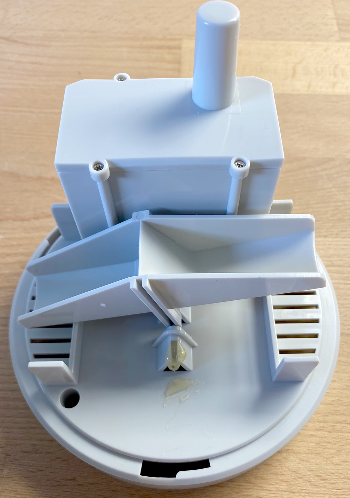
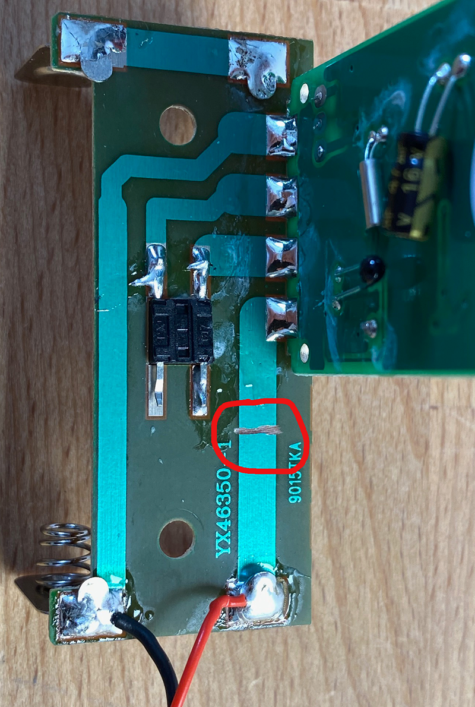
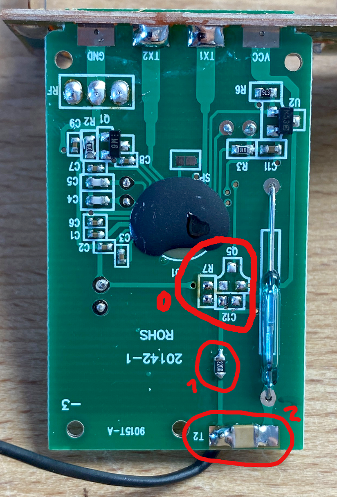
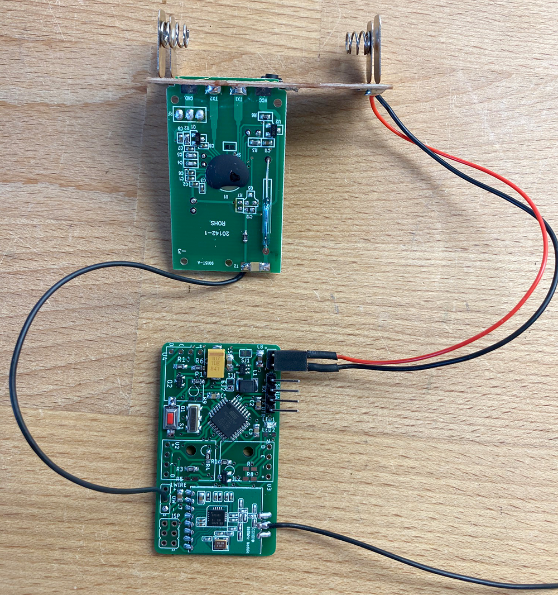

# Umbau TFA Dostmann Regenmesser zu AskSinPP Device

Der [TFA Dostmann Ersatz-Regenmesser, Modell "Monsun"](https://www.amazon.de/gp/product/B00FYSUATO/) eigent sich hervorragend als Basis fuer einen Homebrew-Regenmesser. Es handelt sich um einen klassischen Wippenzaehler mit Reedkontakt und eingearbeitetem Gehaeuse fuer einen proprietaeren Funksender und ein Batteriefach 2xAA.

Ein Wippenschlag entspricht 0.5mm Regen.

Batteriefach und die Platine mit dem Reedkontakt werden wiederverwendet und die HF-Platine wird entfernt und durch eine AskSinPP-taugliche Platine ersetzt, z.B. meine Universalsensorplatine:

[AskSinPP Universal Board](https://github.com/HMSteve/PCBs/tree/master/AskSinPP_UniversalBoard)

## Software

Zunaechst ist das [Addon](https://github.com/HMSteve/HB-UNI-Sen-RainCounter/raw/master/CCU_RM/HB-UNI-Sen-RainCounter-addon.tgz) auf der CCU zu installieren. Die AskSinPP-Platine wird wie ueblich geflasht und kann dann bereits angelernt und getestet werden. Der relevante Datenpunkt ist RAIN_COUNTER, analog dem Homematic-Wetter-Kombisensor. Die CCU erzeugt deswegen beim Anlernen allein Systemvariablen fuer die gestrige und heutige Regenmenge sowie zwei Programme fuer deren Aktualisierung und Ruecksetzung. Dies kann bei Bedarf anschliessend angepasst werden. Ein Impuls am Zaehleingang sollte in der CCU-WebUI als 0.5mm Regen angezeigt werden.

## Umbau des Regenmessers

Zuerst wird der Deckel des Elektronikfaches entfernt, ebenso die beiden Schrauben aus der Platine am Boden des Faches, die die Batteriekontakte traegt. Die HF-Platine kann dann zuerst herausgezogen werden, anschliessend die starr verbundenen Platinen mit dem Reedkontakt sowie mit den Batteriekontakten.

### Schritt 1: Vcc von Originalschaltung trennen

Auf der Platine mit den Batteriekontakten wird die Vcc-Leiterbahn gemaess der Markierung durchtrennt. An die Batteriekontakte wird je eine Litze fuer die Versorgung der AskSinPP-Platine angeloetet.

### Schritt 2: Originalplatine anpassen

Zuerst sollten Q5, C7 und R12 zur Sicherheit entfernt werden, deren Funktion habe ich nicht weiter untersucht, sie sind jedoch mit dem Reedkontakt verbunden (Markierung 0 im Bild).

Zum Entprellen des Reedkontaktes wird sodann ein Tiefpass auf der Platine mit dem Reedkontakt integriert. Dazu wird zunaechst die Leiterbahn unter dem im Ursprungszustand nicht vorhandenen 220R-Widerstand im Bild bei Markierung 1 durchtrennt und sodann ein solcher Widerstand eingeloetet, der exakte Widerstandswert ist eher unkritisch. Danach wird bei Markierung 2 ein Kondensator von ca. 100nF eingeloetet, Bauform 1206 passt perfekt.

Am mit T2 markierten Loetauge wird zuletzt eine Litze fuer den Anschluss der AskSinPP-Platine angeloetet.

### Schritt 3: Zusammenbau

Die Platinen werden verbunden, oben die Originalplatinen, unten die AskSinPP-Platine. Nun kann die Elektronik wieder in das Elektronikfach einziehen. Man kann den im Batteriefach vorhandenen Taster natuerlich auch als Anlerntaster fuer die AskSinPP-Platine nutzen. Mir erschien das unnoetig. Fuer die einfache, Kurzschlussvermeidende Montage der AskSinPP-Platine kann bspw. ein Adapter gedruckt werden, der auf die Platine geschraubt und dann an Stelle der urspruenglichen HF-Platine in die entsprechenden Gehaeusefuehrungen geschoben wird (To-Do).

## Disclaimer

Die Nutzung der hier veroeffentlichten Inhalte erfolgt vollstaendig auf eigenes Risiko und ohne jede Gewaehr.

## Lizenz

Creative Commons BY-NC-SA
